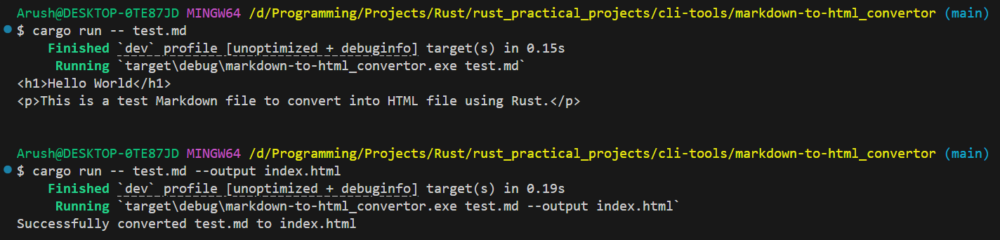

# Markdown to HTML Converter

A simple command-line tool built with Rust that converts Markdown files to HTML using the pulldown-cmark parser.

## Features

- Convert Markdown files to HTML format
- Output to file or stdout
- Fast and lightweight CLI tool
- Supports standard Markdown syntax

## Installation

1. Clone the repository:
```bash
git clone https://github.com/04arush/Rust-Practice.git
cd rust_practical_projects/cli-tools/markdown-to-html_convertor
```

2. Build the project:
```bash
cargo build --release
```

## Usage

### Convert and display to stdout:

```bash
cargo run -- test.md
```

### Convert and save to file:

```bash
cargo run -- test.md --output index.html
```

Or use the compiled binary:

```bash
./target/release/markdown-to-html_convertor test.md -o output.html
```

### Command-line Options

- `<INPUT_FILE>`: Path to the Markdown file (required)
- `-o, --output <FILE>`: Output HTML file path (optional, prints to stdout if not specified)
- `-h, --help`: Display help information
- `-V, --version`: Display version information

## Example

Input file (`test.md`):
```markdown
# Hello World

This is a test Markdown file to convert into HTML file using Rust.
```

Output:



```bash
$ cargo run -- test.md -o index.html
Successfully converted test.md to index.html
```

Generated HTML (`index.html`):
```html
<h1>Hello World</h1>
<p>This is a test Markdown file to convert into HTML file using Rust.</p>
```

## Dependencies

- `pulldown-cmark` - Markdown parser
- `clap` - Command-line argument parsing

## License

MIT License - see [LICENSE.md](LICENSE.md) for details
