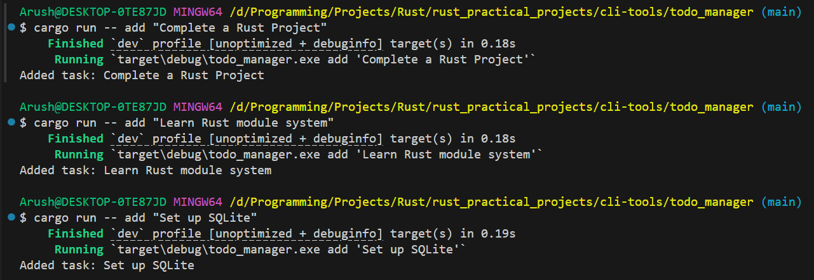
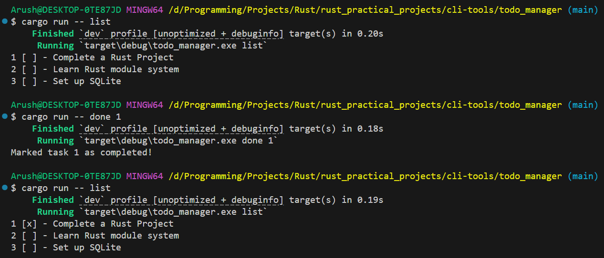

# Todo Manager

A simple, fast CLI task manager built with Rust.

## Features

- Add tasks with descriptions
- List all tasks with completion status
- Mark tasks as completed
- Persistent storage using JSON

## Installation

```bash
cargo build --release
```

## Usage

### Add a task
```bash
cargo run -- add "Your task description"
```

### List all tasks
```bash
cargo run -- list
```

### Mark a task as completed
```bash
cargo run -- done <task_id>
```

## Examples

### Adding tasks


### Viewing and completing tasks


## Technical Details

**Built with:**
- [clap](https://github.com/clap-rs/clap) - Command line argument parsing
- [serde](https://github.com/serde-rs/serde) - Serialization framework
- [serde_json](https://github.com/serde-rs/json) - JSON support

**Storage:** Tasks are persisted to `tasks.json` in the current directory.

## License

MIT License - see [LICENSE.md](LICENSE.md)
