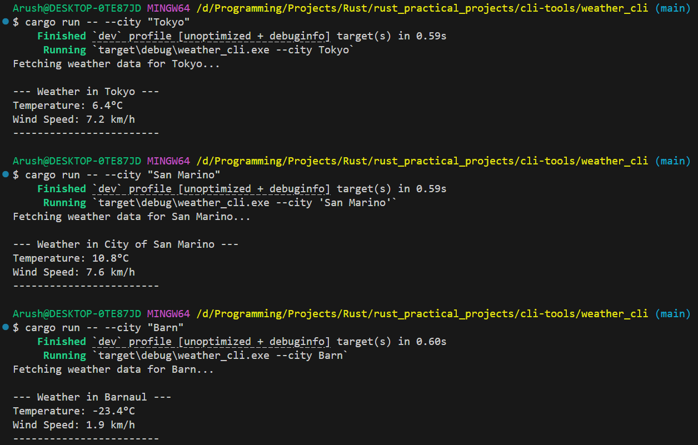

# Weather CLI

A simple command-line weather application built with Rust that fetches real-time weather data for any city using the Open-Meteo API.

## Features

- Fetch weather data for any city worldwide
- Display current temperature in Celsius
- Show wind speed in km/h
- Automatic geocoding to find city coordinates
- Fast and lightweight CLI tool

## Installation

1. Clone the repository:
```bash
git clone <repository-url>
cd rust_practical_projects/cli-tools/weather_cli
```

2. Build the project:
```bash
cargo build --release
```

## Usage

Run the application with the `--city` flag:

```bash
cargo run -- --city "Tokyo"
```

Or use the compiled binary:

```bash
./target/release/weather_cli --city "Tokyo"
```

### Command-line Options

- `-c, --city <CITY>`: Specify the city name (required)
- `-h, --help`: Display help information
- `-V, --version`: Display version information

## Example Output



```
$ cargo run -- --city "Tokyo"
Fetching weather data for Tokyo...

--- Weather in Tokyo ---
Temperature: 6.4°C
Wind Speed: 7.2 km/h
------------------------
```

## Dependencies

- `clap` - Command-line argument parsing
- `reqwest` - HTTP client for API requests
- `serde` - JSON serialization/deserialization
- `tokio` - Async runtime
- `anyhow` - Error handling

## API

This project uses the free [Open-Meteo API](https://open-meteo.com/):
- Geocoding API for city coordinates
- Weather Forecast API for current weather data

No API key required!

## License

MIT License - see [LICENSE.md](LICENSE.md) for details