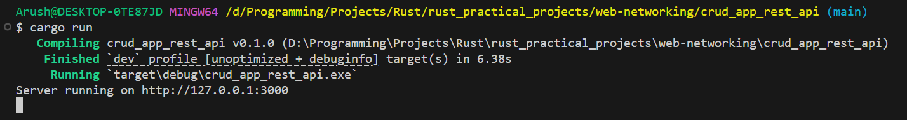
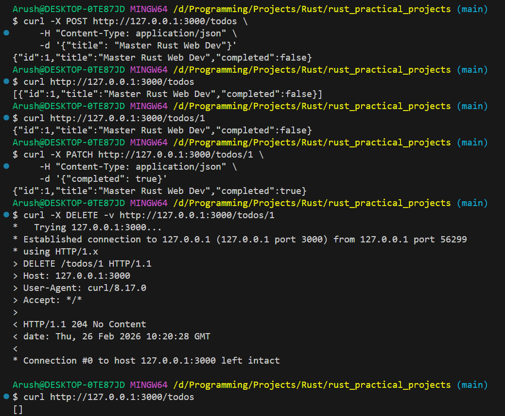

# CRUD App REST API

A simple REST API built with Rust that provides CRUD (Create, Read, Update, Delete) operations for a todo list using SQLite database.

## Features

- Create new todos
- List all todos
- Get a specific todo by ID
- Update todo title and completion status
- Delete todos
- SQLite database with connection pooling
- Async/await with Tokio runtime

## Installation

1. Clone the repository:
```bash
git clone https://github.com/04arush/Rust-Practice.git
cd rust_practical_projects/web-networking/crud_app_rest_api
```

2. Create a `.env` file in the project root:
```bash
DATABASE_URL=sqlite:sqlite.db
```

3. Run database migrations:
```bash
cargo install sqlx-cli
sqlx migrate run
```

4. Build and run the project:
```bash
cargo run
```

## Usage

The server runs on `http://127.0.0.1:3000` by default.

### API Endpoints

#### Create a Todo
```bash
POST /todos
Content-Type: application/json

{
  "title": "Buy groceries"
}
```

#### List All Todos
```bash
GET /todos
```

#### Get a Specific Todo
```bash
GET /todos/{id}
```

#### Update a Todo
```bash
PATCH /todos/{id}
Content-Type: application/json

{
  "title": "Buy groceries and cook dinner",
  "completed": true
}
```

#### Delete a Todo
```bash
DELETE /todos/{id}
```

## Example Output




## Dependencies

- `axum` - Web framework
- `sqlx` - Async SQL toolkit with compile-time query checking
- `tokio` - Async runtime
- `serde` - JSON serialization/deserialization
- `dotenvy` - Environment variable management

## Database Schema

```sql
CREATE TABLE todos (
    id INTEGER PRIMARY KEY AUTOINCREMENT,
    title TEXT NOT NULL,
    completed BOOLEAN NOT NULL DEFAULT 0
);
```

## License

MIT License - see [LICENSE.md](LICENSE.md) for details
