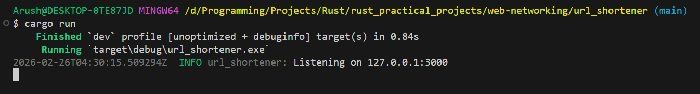
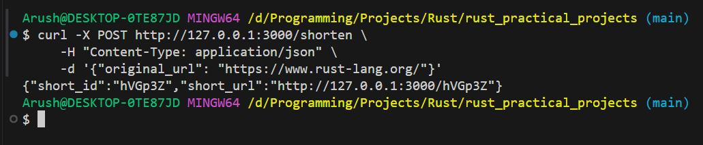

# URL Shortener

A simple URL shortening service built with Rust that creates short, memorable links for long URLs using a REST API.

## Features

- Shorten long URLs to compact 6-character IDs
- Fast URL redirection
- SQLite database for persistent storage
- RESTful API built with Axum
- Automatic database initialization

## Installation

1. Clone the repository:
```bash
git clone https://github.com/04arush/Rust-Practice.git
cd rust_practical_projects/web-networking/url_shortener
```

2. Build the project:
```bash
cargo build --release
```

## Usage

1. Start the server:
```bash
cargo run
```

The server will start on `http://127.0.0.1:3000`

2. Shorten a URL:
```bash
curl -X POST http://127.0.0.1:3000/shorten \
  -H "Content-Type: application/json" \
  -d '{"original_url": "https://www.rust-lang.org/"}'
```

Response:
```json
{
  "short_id": "hVGp3Z",
  "short_url": "http://127.0.0.1:3000/hVGp3Z"
}
```

3. Use the shortened URL:
```bash
curl -L http://127.0.0.1:3000/hVGp3Z
```

The service will redirect you to the original URL.

## API Endpoints

### POST /shorten
Create a shortened URL.

**Request Body:**
```json
{
  "original_url": "https://example.com/very/long/url"
}
```

**Response:**
```json
{
  "short_id": "abc123",
  "short_url": "http://127.0.0.1:3000/abc123"
}
```

### GET /{id}
Redirect to the original URL associated with the short ID.

## Example Output




## Dependencies

- `axum` - Web framework
- `sqlx` - Async SQL toolkit with SQLite support
- `tokio` - Async runtime
- `nanoid` - Unique ID generation
- `serde` - JSON serialization/deserialization
- `tracing` - Logging and diagnostics

## Database

The application uses SQLite for data persistence. The database file (`sqlite.db`) is automatically created on first run with the following schema:

```sql
CREATE TABLE urls (
    id TEXT PRIMARY KEY,
    original_url TEXT NOT NULL
)
```

## License

MIT License - see [LICENSE.md](LICENSE.md) for details
